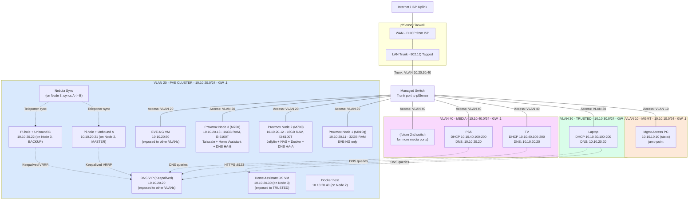

# HomeLab Network Diagram

The logical topology of my home lab, rendered with Mermaid (GitHub renders this automatically).

## Notes
- All addresses are RFC1918 private space (10.10.x.0/24), not reachable from the internet and safe to publish.
- The EVE-NG VM (10.10.20.50), the DNS VIP (10.10.20.20), and the Home Assistant VM (10.10.20.30, TRUSTED only) are the only hosts in the PVE/cluster VLAN reachable from other VLANs. See `ADDRESSING.md` and `PFSENSE-SETUP.md` for the firewall rules that enforce this.
- Clients only ever talk to the DNS VIP, never directly to Pi-hole instance A or B; Keepalived decides which real instance answers, and Nebula Sync keeps both instances' config identical so it doesn't matter which one is live.
- I update this diagram whenever hardware or VLANs change so it reflects the current build.
